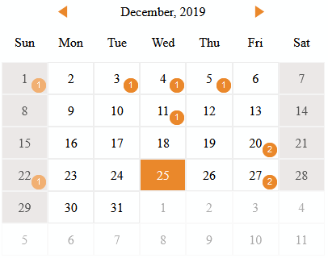

# TypeScript Calendar Control

A light-weight, simple calendar library used in the Marigold relationship management application.


## Building the Calendar

Start by cloning the repository. The only dependency is TypeScript 3.7 which you probably want to install globally:

`npm install -g typescript`

To build the calendar:

`npm run build`

The `tsconfig.json` specifies `dist/js/` as the output folder. If you change this update the reference in `index.html` as well.

`require.js` is used to load modules. A CDN version is referenced in `index.html` to make initial setup easier.


## Using the Calendar

Define the target element where the calendar will be rendered

```TypeScript
const element = document.getElementById("calendar") || document.body;
```

Add the functions to be called on events

```TypeScript
const calendar = new model.Calendar(element, {
    onChange: function (date: Date) {
        
        // called after the month is changed.
        console.log(date.toString());
    },
    onClick: function (date: Date, items: events.CalendarItem[]) {

        // called when a non-disabled day is clicked - you get an array of the day's events (if any)
        console.log("you clicked " + date.toString() + " which has " + items?.length + " item(s)");
    }
});

```

Disable days (optional)

```TypeScript
// disable weekends (Sunday = 0, etc.)
calendar.disabledDays = [0, 6];
```

Add events

```TypeScript
const items = [];

// add your events
let item = new events.CalendarItem("id", new Date(year, month, day));
item.description = "description";
item.duration = 30;
items.push(item);
...

calendar.model = items;
```

Update any styles in `css/calendar.css`

Display the calendar, optionally setting the displayed month (default: current month) and today (default: current day)

```TypeScript
// render (defaults to current month/day)

// show December 2019 and make the 25th "Today"
calendar.render(new Date(2019, 11, 1), new Date(2019, 11, 25));
```




## Notes

* Calendar events are instances of the `CalendarItem` class.
* You can define all of your events up front or load them on demand for each month in your `onChange` function.
* The calendar uses `require.js` for module support (add to the lib folder or update your deployment accordingly).
